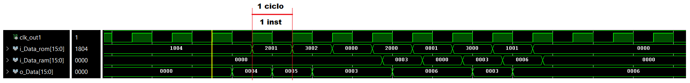

# TP3-BIPS I
Trabajo Practico de Laboratorio Numero 3: BIPS I

## Consigna

Implementar un procesador basico para la educacion especificado en el paper "A Basic Processor for Teaching Digital Circuits and Systems Design with FPGA". En especifico, solo se tiene que implementar el BIP I, la version mas simple que no incluye las instrucciones de salto. Ademas, se tiene que agregar un modulo transmisor UART para mandar el valor actual del acumulador.


## Arquitectura

Es una arquitectura orientada al acumulador. Los datos y las instrucciones son 16 bits. Solo hay un tipo de dato (integer), un tipo de instruccion y dos tipos de direccionamiento, inmediato e indirecto.

El procesador es monociclo, es decir que la instruccion se completa en un ciclo de reloj, por ende la organizacion es Hardvard. Con esto se simplifica la obtencion y ejecucion de las instrucciones. La unidad de control es completamente combinacional para facilitar la implementacion.

Los registros estan limitados. Solo se usan 2:
- El Contadr de Programa (PC, Program Counter): que guarda la direccion de la instruccion actual.
- El Acumulador (ACC; Accumulator): que trabaja como el operando implicito para muchas instrucciones.


### Funcionamiento

El Procesador lee las instrucciones que se encuentran en la memoria del programa. El set de instrucciones es el siguiente.


### Formato de instruccion

- Opcode: es un campo de 5 bits que identifica la operacion que se debe ejecutar segun la instruccion.
- Operand: es un campo de 11 bits que identifica un operando para la instruccion. Puede representar un dato literal o una direccion dentro de la memoria de datos.


### Espacio de memoria

El espacio de direccionamiento de memoria esta organizado en un espacio para la memoria de programa de 2K palabras y un espacio de memoria de datos de 1K palabras. También hay una espacio de dispositivos de entrada y salida de 1K palabras que sirven para iustrar el acceso a drivers basicos como LEDs y otros perifericos mas complejos.


## Organizacion

Al esquema que se encuentra en el paper se le agrego tambien un modulo UART para satisfacer el requerimiento de transmitir en serie el valor del ACC cuando termina el programa.


### Modulo CONTROL

Toma las instrucciones de la memoria de programa, las decodifica y manda todas las señales de control al Datapath. Esta compuesto por:

- Contador de Programa (PC): es un registro de 11 bit que guarda la direccion de la instruccion.
- Incrementador (INC): Es un sumador que le suma 1 a la direccion que esta en el PC.
- Decodificador (DEC, Decoder): Es un circuito puramente combinacional que decodifica la operación que se encuentra en los bits mas significativos de la instruccion, el Opcode. Al procesarlo, manda todas las señales de control necesarias al Datapath.


### Modulo DATAPATH

Procesa los datos segun los comandos enviado por el bloque de Control. Incluye los siguientes modulos:

- Acumulador (ACC): Es un registro de 16 bits que guarda resultados de la alu, el operando de la instruccion o un dato traido de la memoria de datos.
- Unidad aritmetica-logica (ALU): Es una alu de 16 bits que solo suma o resta.
- Extension de señal (Signal Extension): Es un bloque que extiende la señal de 11 bit a 16.
- Dos multiplexores: uno que maneja la entrada al acumulador entre la salida de la ALU, la señal extendida o la entrada de la memoria de datos; y otro que elige una de las entradas de la ALU entre la señal extendida y lo que entra desde la memoria de datos.


### Memoria de Programa

Esta implementada como una memoria ROM de palabras de 16 bits y un espacio de direccion de 11 bits(2K Words).


### Memoria de Datos

Esta implementada como una memoria RAM de palabras de 16 bits y un espacio de direccion de 11 bits(2K Words). Su lectura y escritura son sincronas al clock.


### Modulo UART

Es el mismo modulo implementado en el TP2 aunque sin el receptor. El Baudrate es de 9600 para un reloj de 50MHz. 


### Clocking Wizard

Se usa este modulo para tener mayor control en la señal de clock que va a ingresar a los modulos. El parametro que se especifico fue solamente la frecuencia del clock pero se puede jugar con el jitter, los delays, etc. Se setea la salida a 50MHz.

Como necesita un tiempo para estabilizar, hay una señal llamada locked que señala cuando la salida del Clock Wizard es estable. Se toma esta señal como un reset para el resto del circuito. En este caso tarda mas o menos 500 ns.


## Testing

Se hicieron varios testbench para probar la funcionalidad de cada modulo en particular. Todos estos tienen una metodologia no automatizada y son bastante simples de entender. Luego se realizo un testbench del sistema completo.

### Testing completo

Para el test completo se redujeron los tamaños de las memorias por simplicidad. Ambas tienen solo 9 lugares (son paramatrizables). El programa que se utilizo para la prueba es el siguente.

``` v
0001100000000100 //LDI 4
0010100000000001 //ADDI 1
0011100000000010 //SUBI 2
0000100000000000 //STO 0
0010000000000000 //ADD 0
0000100000000001 //STO 1
0011000000000000 //SUB 0
0001000000000001 //LD 1
0000000000000000 //HLT
```
El dato que se deberia enviar al ultimo es h0006.

## Analisis

### Simulación de comportamiento

Se puede observar como las instrucciones son terminadas en un solo ciclo de Clock. En el flanco de subida se ingresa la nueva instruccion y los valores de las memorias; y en el flanco de bajada se actualiza el valor del acumulador (o_Data). Ademas, se denota que el acumulador actualiza sus valores correctamente segun lo que esta en el programa de prueba.



Aqui se puede visualizar que, una vez terminado el procesamiiento del programa entero y se llega a la instruccion HALT, se manda la se;al tx_done al transmisor UART y este transmite el valor del acumulador (en este caso un h0006).


### Simulación Post-Sintesis con tiempo

Se ve el mismo resultado del procesamiento de instruccion. Hay mas ruido en la entrada de datos que vienen desde la ROM pero, como todo esta sincronizado al clock y los cambios del pc y acumuludar se hacen en el flanco de bajada donde los datos ya estan estables, no hay errores en los calculos. Se obvio la transmision de la señal por el UART ya que toma mucho mas tiempo en comparacion a los otros procesos.


### Analisis de Timing

En el analisis de Timing se ve que se cumplen las constraints para una frecuencia de 50MHz.


El resultado de Worst Negative Slack denota cual es la frecuencia maxima que se puede utilizar en este diseño. La frecuencia máxima es 73 MHz, aproximadamente. El calculo es el siguiente:

